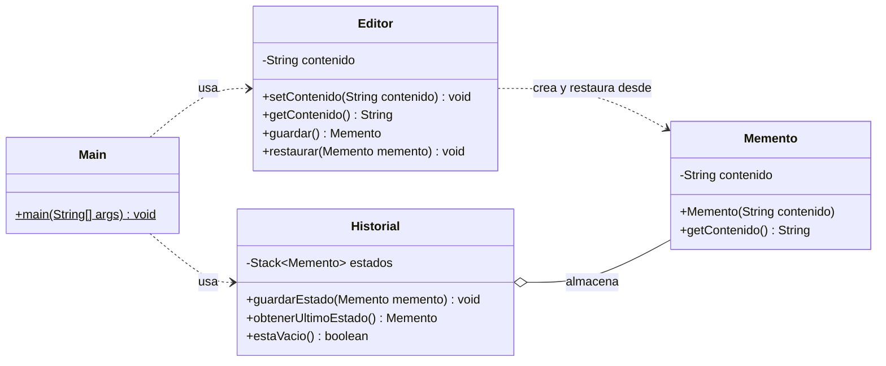
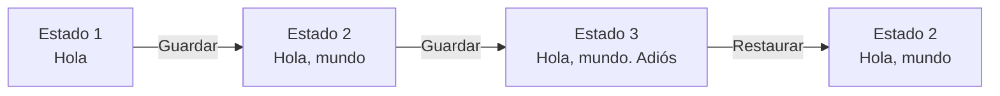

## Diagrama de clases

```mermaid
classDiagram
    direction LR

    class Editor {
        -String contenido
        +setContenido(String contenido) void
        +getContenido() String
        +guardar() Memento
        +restaurar(Memento memento) void
    }

    class Memento {
        -String contenido
        +Memento(String contenido)
        +getContenido() String
    }

    class Historial {
        -Stack~Memento~ estados
        +guardarEstado(Memento memento) void
        +obtenerUltimoEstado() Memento
        +estaVacio() boolean
    }

    class Main {
        +main(String[] args)$ void
    }

    Editor ..> Memento : crea y restaura desde
    Historial o-- Memento : almacena
    Main ..> Editor : usa
    Main ..> Historial : usa
```

## 🔄 Flujo de la prueba

```mermaid
flowchart LR
    A["Estado 1<br/>Hola"] -->|Guardar| B["Estado 2<br/>Hola, mundo"]
    B -->|Guardar| C["Estado 3<br/>Hola, mundo. Adiós"]
    C -->|Restaurar| D["Estado 2<br/>Hola, mundo"]
```

## 🖥️ Salida en consola

